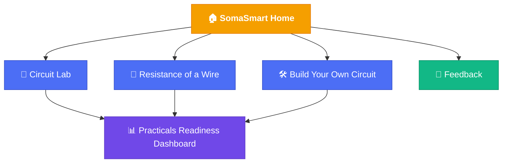

<div align="center">

# 📘 SomaSmart

**A free, browser-based physics companion for students without a fully-equipped lab.**

[](https://streamlit.io)
[](https://www.python.org/)
[](https://supabase.com)
[]()

**[🚀 Try the live app](https://somasmartgit-kagwe-solutions.streamlit.app/)**

</div>

---

## 🎯 Why I Built This

Physics practicals expect you to have handled equipment before you're examined on it — an ammeter, a voltmeter, a resistance wire on a board. Not every school has that equipment. For a student at a small or underresourced school, the first real ammeter you see can be on exam day itself.

<!-- Personal note: replace this with your own version of that moment — the specific
     experience that made this real for you. It's worth more than any general statement. -->

SomaSmart won't replace a real lab. But it gives students a free, no-installation way to practice the actual *skills* a lab teaches — reading an instrument, recording data, plotting a graph — before the exam is the first time it matters.

---

## 🗺️ How It Fits Together



Every practice page feeds the same Readiness Dashboard — it's not five separate tools, it's one picture of where you stand.

---

## 🧰 Features

| | Page | What it does |
|---|---|---|
| 🔌 | **Circuit Lab** | Build series/parallel circuits with resistors or bulbs, then read the real current off an analog meter yourself |
| 🧵 | **Resistance of a Wire** | The classic KCSE resistivity practical — move a jockey, record readings, plot any two quantities against each other |
| 🛠️ | **Build Your Own Circuit** | Design 1–4 components, add an ammeter, galvanometer, and/or voltmeter, then read and check your own measurements |
| 📊 | **Practicals Readiness Dashboard** | An honest mirror of your practical accuracy and which practicals you've actually tried — not a generic score |
| 💬 | **Feedback** | Tell me what's confusing, broken, or missing — saved straight to a database I check |

---

## ⚙️ Tech Stack


Circuits are drawn with [`schemdraw`](https://schemdraw.readthedocs.io/), meter gauges are hand-drawn with `matplotlib`, and feedback/usage tracking run through [Supabase](https://supabase.com).

---

## 💻 Running It Locally

```bash
git clone https://github.com/<your-username>/SOMASMARTAPP.git
cd SOMASMARTAPP
python -m venv venv && venv\Scripts\activate   # or source venv/bin/activate on macOS/Linux
pip install -r requirements.txt
streamlit run app.py
```

You'll also need a `.streamlit/secrets.toml` with your own `SUPABASE_URL` and `SUPABASE_KEY` — see `db.py` for what it expects.

---

## 🔭 What's Next

- [ ] Persist recorded readings to Supabase (currently resets when the tab closes)
- [ ] Trend graphs of reading accuracy over time
- [ ] More practical types beyond electricity

---

<div align="center">

### 💌 A note from me

If you're a student using this — I built it because I wished something like it existed for me. I hope it makes one confusing part of physics prep a little clearer, wherever you're studying from.

**Good luck. — Kagwiria**

</div>
